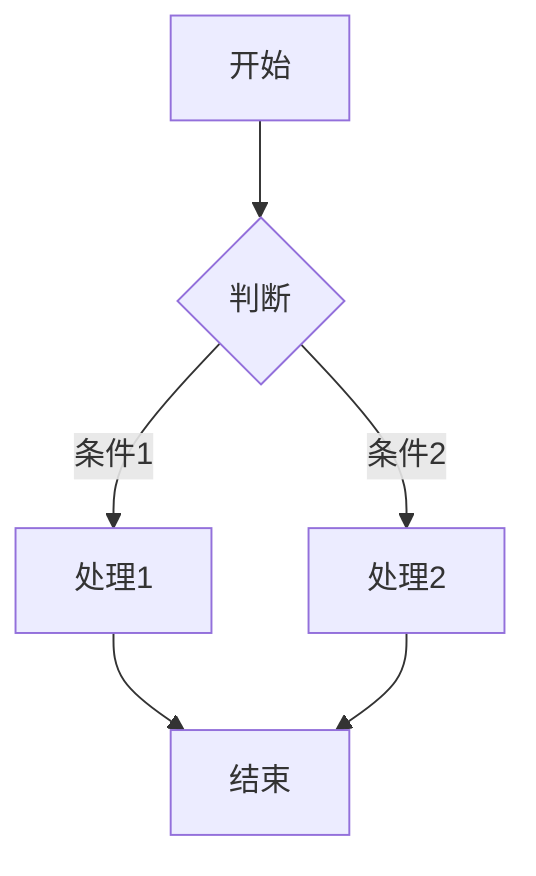
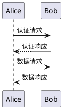

# Doocs Markdown Editor - 使用手册

## 目录

1. [快速开始](#快速开始)
2. [界面介绍](#界面介绍)
3. [Markdown 语法](#markdown-语法)
4. [主题定制](#主题定制)
5. [图床配置](#图床配置)
6. [AI 助手](#ai-助手)
7. [导入导出](#导入导出)
8. [快捷键](#快捷键)
9. [常见问题](#常见问题)

---

## 快速开始

### 在线使用

访问 [https://md.doocs.org](https://md.doocs.org) 即可开始使用。

### 本地部署

#### 方式一：使用 npm CLI

```bash
# 安装
npm i -g @doocs/md-cli

# 启动
md-cli

# 访问
open http://127.0.0.1:8800

# 指定端口
md-cli port=8899
```

#### 方式二：使用 Docker

```bash
docker run -d -p 8080:80 doocs/md:latest
```

访问 http://localhost:8080

#### 方式三：源码部署

```bash
# 克隆仓库
git clone https://github.com/doocs/md.git
cd md

# 安装依赖
nvm i && nvm use
pnpm i

# 启动开发服务器
pnpm web dev

# 访问 http://localhost:5173/md/
```

---

## 界面介绍

### 主界面布局

```
┌─────────────────────────────────────────────────────────────┐
│  [文件] [编辑] [格式] [插入] [视图] [样式] [帮助]           │  ← 顶部菜单栏
├─────────────────────────────────────────────────────────────┤
│  ┌──────────┬──────────┬────────────────────┬──────────┐   │
│  │          │          │                    │          │   │
│  │  文章    │  文件    │   编辑器           │  预览    │   │
│  │  列表    │  目录    │                    │  区域    │   │
│  │          │          │                    │          │   │
│  │ (可收起) │ (可收起) │                    │ (可收起) │   │
│  │          │          │                    │          │   │
│  └──────────┴──────────┴────────────────────┴──────────┘   │
├─────────────────────────────────────────────────────────────┤
│  字数: 1234 | 阅读时间: 5 分钟 | 主题: 默认                  │  ← 底部状态栏
└─────────────────────────────────────────────────────────────┘
```

### 功能区域说明

| 区域 | 功能 |
|------|------|
| **顶部菜单栏** | 文件操作、编辑功能、格式设置、插入元素、视图切换、样式配置、帮助信息 |
| **文章列表** | 管理多篇文章，支持文件夹组织 |
| **文件目录** | 显示本地文件夹结构，支持拖拽导入 |
| **编辑器** | CodeMirror 编辑器，支持语法高亮 |
| **预览区域** | 实时预览渲染效果 |
| **底部状态栏** | 显示字数统计、阅读时间、当前主题 |

---

## Markdown 语法

### 基础语法

#### 标题

```markdown
# 一级标题
## 二级标题
### 三级标题
#### 四级标题
##### 五级标题
###### 六级标题
```

#### 段落和换行

```markdown
这是一个段落。

这是另一个段落，需要空行分隔。
```

#### 强调

```markdown
*斜体* 或 _斜体_
**粗体** 或 __粗体__
***粗斜体*** 或 ___粗斜体___
~~删除线~~
```

#### 列表

```markdown
- 无序列表项 1
- 无序列表项 2
  - 嵌套项 2.1
  - 嵌套项 2.2

1. 有序列表项 1
2. 有序列表项 2
   1. 嵌套项 2.1
   2. 嵌套项 2.2
```

#### 链接和图片

```markdown
[链接文字](https://example.com)
[链接文字](https://example.com "标题")


```

#### 代码

```markdown
行内代码: `const x = 1`

代码块:
```javascript
function hello() {
  console.log('Hello World')
}
```

指定语言获得语法高亮:
```python
def hello():
    print("Hello World")
```
```

#### 引用

```markdown
> 这是一段引用文字
> 可以有多行

> 嵌套引用:
> > 这是嵌套的引用
```

#### 分隔线

```markdown
---
***
___
```

#### 表格

```markdown
| 表头 1 | 表头 2 | 表头 3 |
|--------|--------|--------|
| 单元格 | 单元格 | 单元格 |
| 单元格 | 单元格 | 单元格 |
```

### 扩展语法

#### 数学公式 (KaTeX)

```markdown
行内公式: $E = mc^2$

块级公式:
$$
\sum_{i=1}^{n} x_i = x_1 + x_2 + \cdots + x_n
$$
```

#### Mermaid 图表

```markdown

```

支持的图表类型:
- Flowchart (流程图)
- Sequence Diagram (时序图)
- Class Diagram (类图)
- State Diagram (状态图)
- ER Diagram (实体关系图)
- Gantt Chart (甘特图)
- Pie Chart (饼图)

#### PlantUML

```markdown

```

#### GFM 警告块

```markdown
> [!NOTE]
> 这是一个提示信息

> [!TIP]
> 这是一个建议

> [!IMPORTANT]
> 这是重要信息

> [!WARNING]
> 这是警告信息

> [!CAUTION]
> 这是危险警告
```

#### Ruby 注音

```markdown
[汉字]{hàn zì}
[文字]^(zhù yīn)
```

#### 脚注

```markdown
这是一个带有脚注的句子[^1]

[^1]: 这是脚注的内容
```

#### 目录

```markdown
[[toc]]
```

#### 轮播图

```markdown
::: slider


:::
```

---

## 主题定制

### 预设主题

编辑器提供多种预设主题，可在顶部菜单 **样式 > 主题** 中切换:

- 默认主题
- 极简主题
- 优雅主题
- 商务主题
- 活泼主题

### 自定义样式

#### 基础设置

在 **样式 > 基础设置** 中可以配置:

| 设置项 | 说明 |
|--------|------|
| 字体 | 无衬线 / 衬线 / 等宽 |
| 字号 | 14px - 18px |
| 主题色 | 12 种预设颜色 |
| 代码主题 | 90+ 种 highlight.js 主题 |

#### 标题样式

在 **样式 > 标题样式** 中可为每个标题级别设置:

- 默认样式
- 主题色文字
- 底部边框
- 左侧边框
- 自定义 CSS

#### 高级设置

| 设置项 | 说明 |
|--------|------|
| Mac 代码块 | 显示 Mac 风格的窗口按钮 |
| 代码行号 | 显示代码行号 |
| 引用链接 | 微信外链接底部显示引用 |
| 字数统计 | 显示阅读时间和字数 |
| 首行缩进 | 段落首行缩进两字符 |
| 两端对齐 | 段落两端对齐 |

### 自定义 CSS

点击编辑器右侧的 **CSS** 按钮，可以编写自定义 CSS:

```css
/* 自定义标题样式 */
h1 {
  color: #ff6b6b;
  border-bottom: 3px solid #ff6b6b;
}

/* 自定义引用块样式 */
blockquote {
  border-left: 4px solid #4ecdc4;
  background: #f7f7f7;
}
```

---

## 图床配置

### 支持的图床

| 图床 | 特点 |
|------|------|
| **默认** | 使用 GitHub，无需配置 |
| **GitHub** | 自定义仓库，需要 Token |
| **阿里云 OSS** | 稳定快速，适合国内 |
| **腾讯云 COS** | 稳定快速，适合国内 |
| **七牛云** | 有免费额度 |
| **MinIO** | 自建对象存储 |
| **S3 协议** | AWS S3 及兼容服务 |
| **公众号** | 上传到微信素材库 |
| **Cloudflare R2** | 海外访问快 |
| **又拍云** | 国内 CDN |
| **Telegram** | 免费，适合海外 |
| **Cloudinary** | 专业图片 CDN |
| **自定义** | 自定义上传逻辑 |

### 配置方法

#### GitHub 图床

1. 进入 **设置 > 图床设置 > GitHub**
2. 填写配置:
   - **仓库**: `用户名/仓库名`
   - **分支**: `main` 或 `master`
   - **Token**: [如何获取](https://docs.github.com/en/github/authenticating-to-github/creating-a-personal-access-token)

#### 阿里云 OSS

1. 进入 **设置 > 图床设置 > 阿里云**
2. 填写配置:
   - **AccessKey ID**: 阿里云 AccessKey
   - **AccessKey Secret**: 阿里云 Secret
   - **Bucket**: 存储桶名称
   - **Region**: 地域节点 (如 `oss-cn-beijing`)
   - **CDN 域名** (可选): 自定义加速域名

#### 微信公众号

1. 进入 **设置 > 图床设置 > 公众号**
2. 填写配置:
   - **appID**: 公众号 AppID
   - **appsecret**: 公众号 AppSecret
   - **代理域名** (可选): 用于绕过微信 API 限制

### 图片上传方式

1. **点击上传**: 点击工具栏图片按钮选择文件
2. **拖拽上传**: 直接拖拽图片到编辑器
3. **粘贴上传**: 复制图片后粘贴 (Ctrl+V)
4. **截图粘贴**: 截图后直接粘贴

---

## AI 助手

### 支持的 AI 服务

- DeepSeek
- OpenAI / ChatGPT
- 通义千问
- 腾讯混元
- 火山方舟
- 302.AI
- 自定义 API

### 配置 AI 服务

1. 点击左侧边栏的 **AI** 图标
2. 选择 AI 服务提供商
3. 填写 API Key 和模型名称
4. 点击保存

### AI 功能

#### 1. 智能对话

在 AI 面板输入问题，AI 会帮助您:
- 解答 Markdown 语法问题
- 提供写作建议
- 优化文章结构

#### 2. 快捷命令

选中编辑器中的文字，使用快捷命令:

| 命令 | 功能 |
|------|------|
| 续写 | 根据上下文续写内容 |
| 润色 | 优化文字表达 |
| 翻译 | 翻译成其他语言 |
| 总结 | 生成内容摘要 |
| 扩写 | 扩展内容细节 |
| 精简 | 压缩冗余内容 |

#### 3. AI 图片生成

配置图像生成服务后，可以:
- 根据描述生成配图
- 生成文章封面图
- 生成插图

### 使用示例

```
用户: 帮我优化这段话
AI: 好的，这是优化后的版本...

用户: /续写 人工智能正在改变
AI: [续写内容...]
```

---

## 导入导出

### 导入

#### 导入 Markdown 文件

1. 点击 **文件 > 导入 Markdown**
2. 选择 `.md` 文件
3. 自动解析并加载内容

#### 从文件夹导入

1. 点击 **文件 > 打开文件夹**
2. 选择包含 Markdown 文件的文件夹
3. 自动加载文件夹结构和所有 Markdown 文件

#### 拖拽导入

直接拖拽 Markdown 文件或文件夹到编辑器区域即可导入。

### 导出

#### 导出 Markdown

**文件 > 导出 > Markdown**

导出原始 Markdown 文件。

#### 导出 HTML

**文件 > 导出 > HTML**

导出带样式的 HTML 文件，包含:
- 完整的 CSS 样式
- 响应式布局
- 可离线查看

#### 导出 PDF

**文件 > 导出 > PDF**

导出 PDF 文档，适合:
- 打印
- 分享
- 存档

#### 复制到公众号

**文件 > 复制到公众号** 或点击顶部 **复制** 按钮

1. 点击复制按钮
2. 在微信公众平台编辑器中粘贴
3. 保持完整格式

---

## 快捷键

### 编辑操作

| 快捷键 | 功能 |
|--------|------|
| `Ctrl + S` | 保存到本地存储 |
| `Ctrl + Z` | 撤销 |
| `Ctrl + Shift + Z` | 重做 |
| `Ctrl + F` | 查找 |
| `Ctrl + H` | 查找并替换 |
| `Ctrl + /` | 注释/取消注释 |

### 格式操作

| 快捷键 | 功能 |
|--------|------|
| `Ctrl + B` | 粗体 |
| `Ctrl + I` | 斜体 |
| `Ctrl + K` | 插入链接 |
| `Ctrl + Shift + K` | 插入代码块 |
| `Ctrl + Shift + I` | 插入图片 |

### 视图操作

| 快捷键 | 功能 |
|--------|------|
| `F11` | 全屏模式 |
| `Ctrl + Shift + F` | 格式化文档 |
| `Ctrl + Shift + L` | 切换主题 |

### 文章操作

| 快捷键 | 功能 |
|--------|------|
| `Ctrl + N` | 新建文章 |
| `Ctrl + Shift + N` | 新建文件夹 |
| `Ctrl + W` | 关闭当前文章 |

---

## 常见问题

### 1. 图片上传失败

**问题**: 图片上传后显示失败

**解决方案**:
- 检查图床配置是否正确
- 确认网络连接正常
- 查看浏览器控制台错误信息
- 尝试切换其他图床

### 2. 预览和实际效果不一致

**问题**: 编辑器预览和复制到公众号后效果不同

**解决方案**:
- 使用 **复制到公众号** 功能而非直接复制
- 检查自定义 CSS 是否兼容微信
- 避免使用过于复杂的 CSS 选择器

### 3. 内容丢失

**问题**: 编辑的内容突然消失

**解决方案**:
- 编辑器每 30 秒自动保存历史记录
- 点击 **文件 > 历史记录** 恢复
- 定期手动导出备份

### 4. 数学公式不渲染

**问题**: 数学公式显示为原始文本

**解决方案**:
- 确保使用正确的语法: `$行内$` 或 `$$块级$$`
- 检查公式语法是否正确
- 刷新页面重试

### 5. Mermaid 图表不显示

**问题**: Mermaid 代码块不渲染为图表

**解决方案**:
- 确保代码块标记为 `mermaid`
- 检查 Mermaid 语法是否正确
- 复杂图表可能需要简化

### 6. 代码高亮不生效

**问题**: 代码块没有语法高亮

**解决方案**:
- 确保指定了正确的语言: ```javascript
- 在 **样式 > 代码主题** 中选择高亮主题
- 部分语言需要动态加载，稍等片刻

### 7. 如何自定义主题

**解决方案**:
1. 点击右侧 **CSS** 按钮
2. 编写自定义 CSS
3. 使用浏览器开发者工具检查元素类名
4. 参考默认主题 CSS 结构

### 8. 移动端使用

**问题**: 如何在手机上使用

**解决方案**:
- 使用在线版本: https://md.doocs.org
- 界面会自动适配移动端
- 支持切换编辑/预览视图

### 9. 浏览器扩展安装

**Chrome 扩展**:
1. 下载扩展文件
2. 打开 `chrome://extensions/`
3. 开启开发者模式
4. 加载已解压的扩展

**Firefox 扩展**:
1. 下载 `.xpi` 文件
2. 拖放到 Firefox 窗口
3. 点击安装

### 10. 数据备份

**如何备份数据**:
1. **导出 Markdown**: 定期导出所有文章
2. **导出 HTML**: 保存带样式的版本
3. **浏览器同步**: 使用浏览器账号同步 localStorage

---

## 更新日志

### v2.1.0
- 新增 AI 图片生成功能
- 支持更多图床服务
- 优化主题系统
- 改进移动端体验

### v2.0.0
- 全新主题系统
- 支持文件夹管理
- 新增 PlantUML 支持
- 性能优化

---

## 获取帮助

- **GitHub Issues**: https://github.com/doocs/md/issues
- **Discussions**: https://github.com/doocs/md/discussions
- **在线文档**: https://md.doocs.org

---

*手册版本: 2.1.0*
*最后更新: 2026-02-08*
